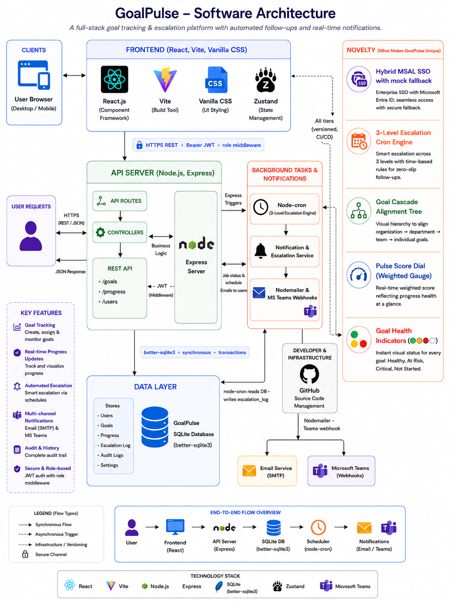

# 🎯 GoalPulse — In-House Goal Setting & Tracking Portal

> **GoalPulse** is an enterprise-grade, high-performance Goal Setting, Alignment, and Automated Governance platform built for modern organizations. Designed from the ground up to eliminate spreadsheet silos, manual follow-ups, and review cycle blind spots, it equips HR Admins, L1 Managers, and Contributors with real-time performance insights and automated policy compliance.

---

## 📐 Software Architecture & Flow Overview

GoalPulse is engineered using a lightweight, blazing-fast, and decoupled modular architecture. Below is the high-fidelity system blueprint illustrating the end-to-end data pipeline, auth wrappers, local cron orchestrations, and outgoing integration nodes:



---

## 🛠️ The Technology Stack

GoalPulse leverages modern, highly responsive, and robust tools to deliver sub-100ms response times and microsecond database queries:

*   **🖥️ Frontend client**: **React 18 + Vite** for instantaneous hot-module reloading and highly optimized production builds.
*   **📦 State Management**: **Zustand** for simple, persistent, boilerplate-free client auth sessions and global state configurations.
*   **🎨 Styling & UI/UX**: **Vanilla CSS (Glassmorphism)** featuring dynamic hover grids, modern HSL-tailored dark modes, fluid micro-animations, and responsive grids (no Tailwind / Redux overhead!).
*   **⚙️ Backend Server**: **Node.js + Express** driving an asynchronous MVC controller architecture.
*   **💾 Database Persistence**: **SQLite via direct SQL execution (`better-sqlite3`)** delivering native-speed synchronous queries, database-level locking, and transactional integrity.
*   **🕒 Automations Engine**: **node-cron** powering a self-contained local cron scheduler to evaluate timeline escalations daily.
*   **📧 Sandbox Mailer**: **nodemailer** delivering secure, template-styled transaction alert inboxes.
*   **📊 Reports Generation**: **exceljs** compiling programmatically styled, color-coded spreadsheets with injected regulatory disclaimer headers.

---

## 🚀 Key Feature Highlights

### 1. Goal Setting, Validation & Life Cycle Locks
*   **Governance Limits**: Enforces a maximum of 8 goals per cycle and a strict 10% minimum weightage floor per objective.
*   **100% Rebalance Engine**: Features an interactive goal weight progress tracker, locking goal sheets on submission to preserve a single source of truth.
*   **Audit Logging**: Every single modification, manager override, or target adjustment is recorded with timestamps in the global `audit_log` table.

### 2. Quarterly Check-ins & Progress Scoring
*   **UoM Scoring Algorithms**: Dynamically calculates achievement scores based on Unit of Measure (UoM) types:
    *   *Numeric Increase / Decrease* (proportional calculations).
    *   *Timeline Check-ins* (calculating exact days ahead or overdue with sliding penalties).
    *   *Percentage Completions* (linear progress math).
*   **Feedback Loops**: Integrates manager review comment sections directly beneath check-in targets.

### 3. Shared Cascaded Corporate Goals
*   **Top-down Alignment**: Admins can push corporate objectives down to select employee brackets.
*   **Cascade Lock**: Pushed corporate goals remain read-only for employees (except weightage parameters).
*   **Cascade Graph**: A gorgeous, interactive hierarchical node tree (`CascadeGraph.jsx`) illustrating parental goal relationships and average department alignments.

### 4. Configurable Governance & 3-Level Escalations
*   **Rule Engine**: Automated daily cron scans for:
    *   *Rule 1*: Overdue employee goal sheets (missing submission).
    *   *Rule 2*: Overdue manager reviews (approvals pending).
    *   *Rule 3*: Overdue quarterly check-in completion.
*   **3-Level Multi-Chain Alerts**: Escalates warnings dynamically from **Level 1 (Employee Email Warning)** ➔ **Level 2 (L1 Manager Nudge notification)** ➔ **Level 3 (HR Admin Audit Log escalation)**.

---

## 🌟 Hackathon Novelty & Innovation Spotlights

GoalPulse stands apart from generic portals through several premium, high-fidelity developer innovations:

1.  **⚡ Interactive Quick Role-Switcher Widget**: Swaps active sessions dynamically between **Admin (HR)**, **Manager (L1)**, and **Employee (Contributor)** with a single click, instantly re-signing JWT bearer auth requests to demonstrate end-to-end flows in under 60 seconds without logging out.
2.  **🛡️ MSAL Hybrid Microsoft SSO Overlay**: Center-aligned, blurred Microsoft login selector pulling seeded SQL domain accounts for instant visual demo authentication when real tenant Azure Client IDs are omitted.
3.  **💬 Microsoft Teams Adaptive Card Webhooks**: Sends rich, structured JSON Adaptive Cards to Teams channels (or logs beautiful, styled mock cards with deep-links in your server terminal if standard webhooks are disabled by enterprise IT policies).
4.  **🧠 Smart One-Click Weightage Suggester**: A mathematical suggestion engine that automatically balances remaining sheet weights to hit exactly 100% while keeping individual objectives above the 10% threshold.
5.  **🔥 Compliance Streak Tracker**: Encourages continuous contributor tracking by displaying animated compliance badges and streaks on dashboards.

---

## 🏁 Quick Start & Local Execution

### Prerequisites
*   **Node.js v18+**

### 1. Launch the Backend Server
```bash
# Navigate to the backend directory
cd backend

# Install production dependencies
npm install

# Seed the database (Creates the SQLite DB, populates demo users, cycles, and escalations)
npm run seed

# Boot the API server in developer watch mode
npm run dev
```
*   *The Backend API will listen on `http://localhost:5000`*

### 2. Launch the Frontend Client
```bash
# Navigate to the frontend directory (Open a second terminal window)
cd frontend

# Install client packages
npm install

# Boot the Vite development server
npm run dev
```
*   *The Frontend client will boot on `http://localhost:5173`*

---

### 🔑 Demo Accounts & 1-Click Sandbox
For quick evaluation, use the floating **Role Switcher Widget** at the top center of your screen to swap between these seeded demo accounts instantly:

| Role | Seeded Email | Password |
| :--- | :--- | :--- |
| **HR / System Admin** | `admin@goalpulse.demo` | `Demo@123` |
| **L1 Reporting Manager** | `manager@goalpulse.demo` | `Demo@123` |
| **Employee One** | `employee@goalpulse.demo` | `Demo@123` |
| **Employee Two** | `employee2@goalpulse.demo` | `Demo@123` |
| **Employee Three** | `employee3@goalpulse.demo` | `Demo@123` |

---

### 🕒 Instantly Test Escalations & Emails
To test the email and escalation rule triggers without waiting 24 hours:
1.  Log in as **Admin** (`admin@goalpulse.demo`).
2.  Navigate to **Org Manager** ➔ **System Configuration & Developer Settings**.
3.  Click the blue **`Trigger Daily Cron Run`** button.
4.  Watch your console terminal light up as it processes overdue sheets, logs escalations, and dispatches test emails to your Ethereal Sandbox mailer inbox!
